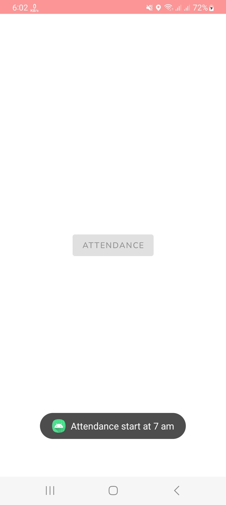

## General

e-OMS Application

<a id="raw-url" href="apk/e-OMS.apk?raw=true">
</a>


## Screenshots

| Location Permission | Login | Registration |
| :----------: | :----------: | :----------: |
|  |  |  |


| Location Setup | Presence | No Internet |
| :-----------------: | :---: | :----------: |
|  |  |  |


## Dependencies 

- API CALL Dependencies

```
implementation("com.squareup.retrofit2:retrofit:2.9.0")
implementation("com.squareup.retrofit2:converter-gson:2.9.0")
implementation("com.squareup.okhttp3:logging-interceptor:5.0.0-alpha.2")
implementation ("com.google.code.gson:gson:2.10")
```

- Android Architecture Components

```
implementation ("androidx.lifecycle:lifecycle-runtime-ktx:2.5.1")
```

 - Google Map Dependencies
 ```
 implementation ("com.google.android.gms:play-services-maps:18.1.0")
 ```

